# 《实验二：**索引&文档操作**》

学院：省级示范性软件学院
题目：《实验二：索引操作与文档操作练习》
姓名：杨尧炜
学号：2200770008
班级：软工2202
日期：2024-09-14
实验环境：Elasticsearch8.12.2 apifox

---
---
## 一 实验目的 

1. 掌握Elasticsearch 安装IK分词器安装方法
2. 掌握Elasticsearch 索引操作方法
3. 掌握Elasticsearch 文档操作训练
4. 掌握Elasticsearch 高级查询与DSL训练


## 二 实验内容 

### 1. 掌握Elasticsearch 安装IK分词器安装方法

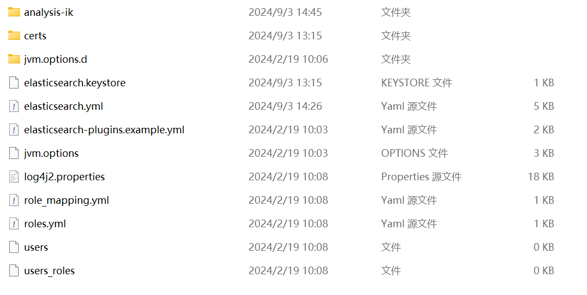


### 2. 掌握Elasticsearch 索引操作方法
索引操作练习
	要求：能够根据字段描述，创建索引，修改索引，删除索引
任务一：

1. 创建索引

2. 修改索引(自己设计，修改要合理）

3. 删除索引

4. 查看所有用户信息 (User Information) 索引

 - user_id:
    ○ 类型: keyword
    ○ 描述: 用户的唯一标识符，通常是一个不变的字符串。用于快速查找和过滤用户。

-  name:
    ○ 类型: text
    ○ 描述: 用户的姓名。使用标准分析器处理以支持全文搜索。

-  email:
    ○ 类型: keyword
    ○ 描述: 用户的电子邮件地址。作为关键词存储以确保精确匹配，便于查找。

-  date_of_birth:
    ○ 类型: date
    ○ 描述: 用户的出生日期，格式为日期类型，便于进行年龄计算和范围查询。

-  gender:
    ○ 类型: keyword
    ○ 描述: 用户的性别信息，通常为固定值（如“male”、“female”），用于过滤和统计分析。

-  address:
    ○ 类型: text
    ○ 描述: 用户的居住地址。支持全文搜索以便于地址相关查询。

-  phone_number:
    ○ 类型: keyword
    ○ 描述: 用户的电话号码，作为关键词存储以确保精确匹配。

-  registration_date:
     ○ 类型: date
     ○ 描述: 用户注册账户的日期，用于时间序列分析和统计。

-  last_login:
     ○ 类型: date
     ○ 描述: 用户最后一次登录的日期和时间，便于跟踪用户活动。

-  status:
     ○ 类型: keyword
     ○ 描述: 用户账户的当前状态（如“active”、“inactive”），用于筛选和状态管理。
       产品目录 (Product Catalog) 索引

-  product_id:
     ○ 类型: keyword
     ○ 描述: 产品的唯一标识符，通常是一个不变的字符串。用于快速查找和过滤特定产品。

-  name:
     ○ 类型: text
     ○ 描述: 产品的名称。使用标准分析器处理以支持全文搜索和匹配。

-  description:
     ○ 类型: text
     ○ 描述: 产品的详细描述。支持全文搜索，使用户能够通过关键词查找产品。

-  category:
     ○ 类型: keyword
     ○ 描述: 产品所属的类别，用于分类和过滤产品。

-  price:
     ○ 类型: double
     ○ 描述: 产品的价格，以浮点数表示，便于进行价格范围查询和排序。

-  stock_quantity:
     ○ 类型: integer
     ○ 描述: 产品的库存数量，以整数表示，用于库存管理和查询。

-  supplier:
     ○ 类型: keyword
     ○ 描述: 产品的供应商信息，通常是供应商的名称或ID，用于追踪和管理供应链。

-  release_date:
     ○ 类型: date
     ○ 描述: 产品的发布日期，便于进行时间序列分析和新产品的筛选。

-  tags:
     ○ 类型: keyword
     ○ 描述: 与产品相关的标签，用于搜索和过滤产品。

-  rating:
     ○ 类型: float
     ○ 描述: 产品的平均评分，以浮点数表示，用于排序和筛选高评分产品。
       订单记录 (Order Records) 索引字段描述

-  order_id:
     ○ 类型: keyword
     ○ 描述: 订单的唯一标识符，用于快速查找和管理订单。

-  customer_id:
     ○ 类型: keyword
     ○ 描述: 客户的唯一标识符，关联到用户信息，便于查询特定客户的订单记录。

-  order_date:
     ○ 类型: date
     ○ 描述: 订单创建的日期和时间，用于时间序列分析和订单管理。

-  status:
     ○ 类型: keyword
     ○ 描述: 订单的当前状态（如“pending”、“shipped”、“completed”），用于筛选和管理订单。

-  total_amount:
     ○ 类型: double
     ○ 描述: 订单的总金额，以浮点数表示，用于财务分析和报告。

-  items:
     ○ 类型: nested
     ○ 描述: 订单中包含的商品列表，每个商品包含以下字段：
     ■ product_id: keyword - 商品的唯一标识符。
     ■ quantity: integer - 购买的商品数量。
     ■ price: double - 商品的单价。

-  shipping_address:
     ○ 类型: text
     ○ 描述: 订单的送货地址，支持全文搜索以便于地址相关查询。

-  payment_method:
     ○ 类型: keyword
     ○ 描述: 使用的支付方式（如“credit card”、“paypal”），用于支付方式分析和报告。

-  shipping_date:
     ○ 类型: date
     ○ 描述: 订单发货的日期，便于物流跟踪和管理。

-  delivery_date:
     ○ 类型: date
     ○ 描述: 订单预计或实际送达的日期，用于客户服务和物流优化。
```
其余类似
     http://localhost:9200/product_catalog     
     {    
      "product_catalog": {    
      "aliases": {},  

     ​    "mappings": {
     
     ​      "properties": {
     
     ​        "category": {
     
     ​          "type": "keyword"
     
     ​        },
     
     ​        "description": {
     
     ​          "type": "text"
     
     ​        },
     
     ​        "name": {
     
     ​          "type": "text"
     
     ​        },
     
     ​        "price": {
     
     ​          "type": "double"
     
     ​        },
     
     ​        "product_id": {
     
     ​          "type": "keyword"
     
     ​        },
     
     ​        "rating": {
     
     ​          "type": "float"
     
     ​        },
     
     ​        "release_date": {
     
     ​          "type": "date"
     
     ​        },
     
     ​        "stock_quantity": {
     
     ​          "type": "integer"
     
     ​        },
     
     ​        "supplier": {
     
     ​          "type": "keyword"
     
     ​        },
     
     ​        "tags": {
     
     ​          "type": "keyword",
     
     ​          "fields": {
     
     ​            "raw": {
     
     ​              "type": "keyword",
     
     ​              "ignore_above": 256
     
     ​            }
     
     ​          }
     
     ​        }
     
     ​      }
     
     ​    },
     
     ​    "settings": {
     
     ​      "index": {
     
     ​        "routing": {
     
     ​          "allocation": {
     
     ​            "include": {
     
     ​              "_tier_preference": "data_content"
     
     ​            }
     
     ​          }
     
     ​        },
     
     ​        "number_of_shards": "1",
     
     ​        "provided_name": "product_catalog",
     
     ​        "creation_date": "1725877640100",
     
     ​        "number_of_replicas": "1",
     
     ​        "uuid": "LTQ-Hs66Ti-Iri5ttbH0Lw",
     
     ​        "version": {
     
     ​          "created": "8500010"
     
     ​        }
     
     ​      }
     
     ​    }
     
       }
     
     }
```

## 3. 高级查询&DSL练习

任务三：

完成下面的30道练习题

###  3.1. 用户信息数据
```
1. 查询所有女性用户的姓名和电子邮件。

GET /user_information/_search
{
  "query": {
    "term": {
      "gender": "female"
    }
  },
  "_source": ["name", "email"]
}
```
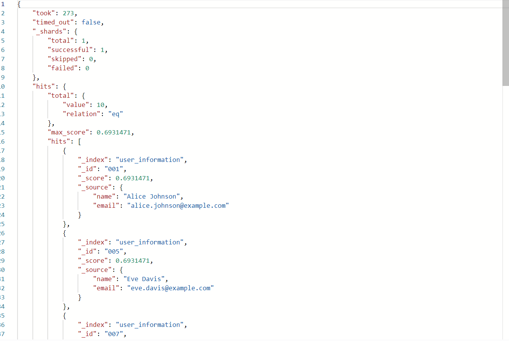
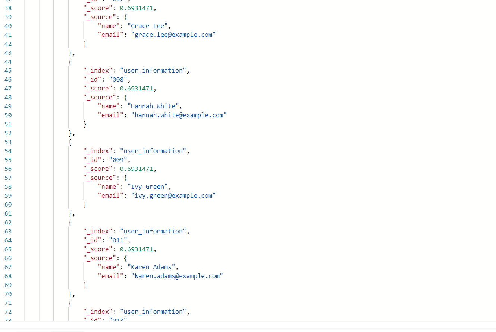
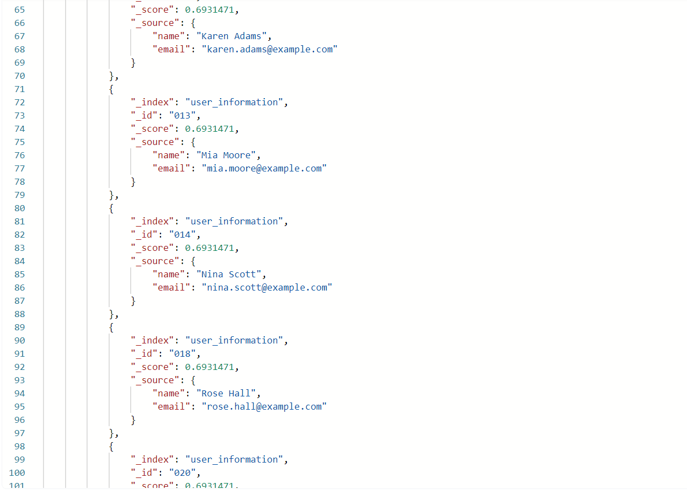

```
2. 查找最后登录日期在2024年9月1日之后的所有活跃用户。
GET /user_information/_search
{
  "query": {
    "bool": {
      "must": [
        { "term": { "status": "active" }},
        { "range": { "last_login": { "gt": "2024-09-01" }}}
      ]
    }
  }
}
```
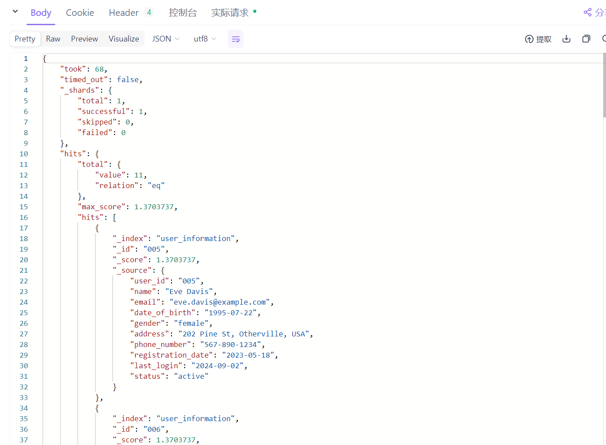
```
3. 查询住在"Anytown"的用户。
GET /user_information/_search
{
  "query": {
    "match": {
      "address": "Anytown"
    }
  }
}
```
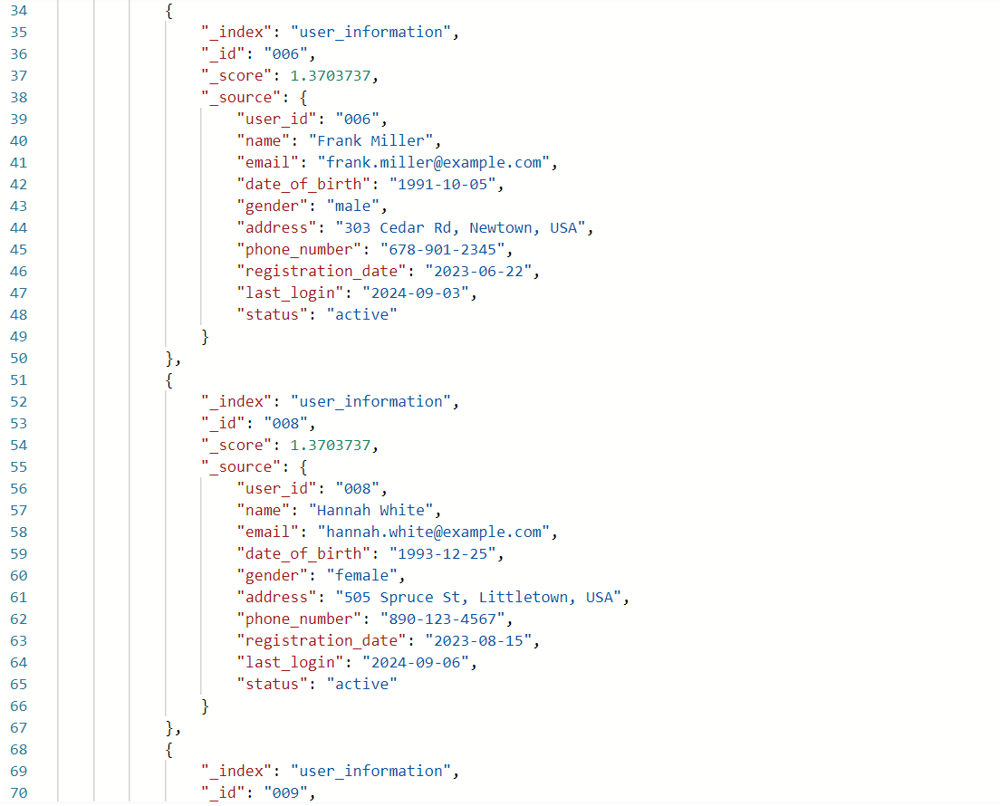
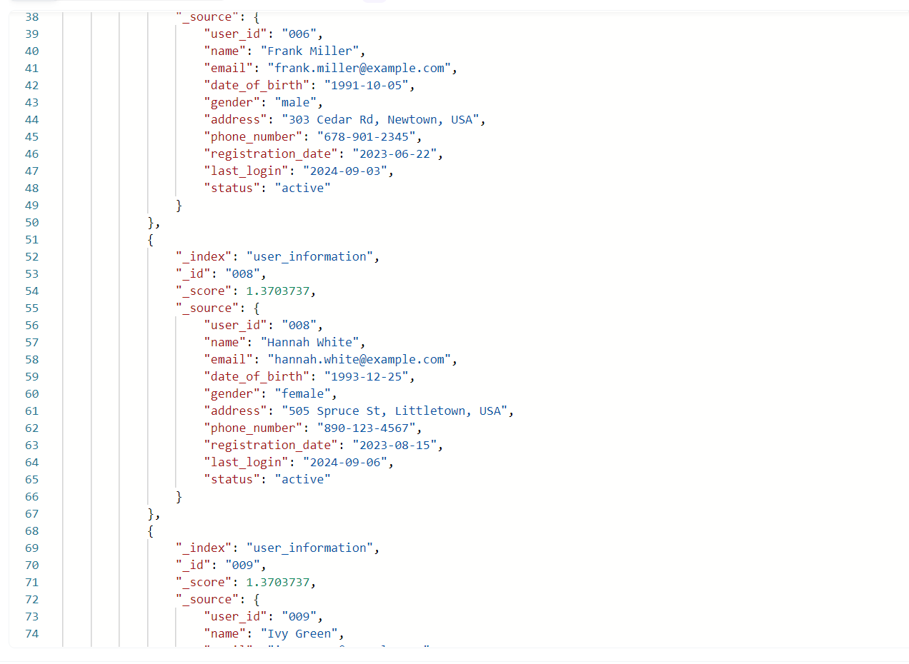

```
4. 查找出生日期在1990年之后的所有用户。
GET /user_information/_search
{
  "query": {
    "range": {
      "date_of_birth": { "gt": "1990-01-01" }
    }
  }
}
```
略
```
5. 查询所有状态为"inactive"的用户。
GET /user_information/_search
{
  "query": {
    "term": {
      "status": "inactive"
    }
  }
}

6. 查找注册日期在2023年1月1日到2023年12月31日之间的用户。
GET /user_information/_search
{
  "query": {
    "match": {
      "name": "Bob Smith"
    }
  }
}

7. 查询名字为"Bob Smith"的用户的详细信息。
GET /user_information/_search
{
  "query": {
    "prefix": {
      "phone_number": "123"
    }
  }
}

8. 查找电话号码以"123"开头的用户。
GET /user_information/_search
{
  "query": {
    "prefix": {
      "phone_number": "123"
    }
  }
}

9. 查询电子邮件域为"example.com"的所有用户。
GET /user_information/_search
{
  "query": {
    "wildcard": {
      "email": "*@example.com"
    }
  }
}

10. 查找所有名字中包含"Lee"的用户。
GET /user_information/_search
{
  "query": {
    "wildcard": {
      "name": "*Lee*"
    }
  }
}


```
###   3.2. 产品目录数据
```
    1. 查询所有类别为"Audio"的产品名称和价格。
GET /products/_search
{
  "query": {
    "term": {
      "category": "Audio"
    }
  },
  "_source": ["name", "price"]
}
```
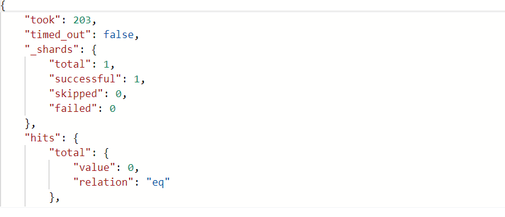
```
    2. 查找价格高于50美元的所有产品。
GET /products/_search
{
  "query": {
    "range": {
      "price": {
        "gt": 50
      }
    }
  }
}
```
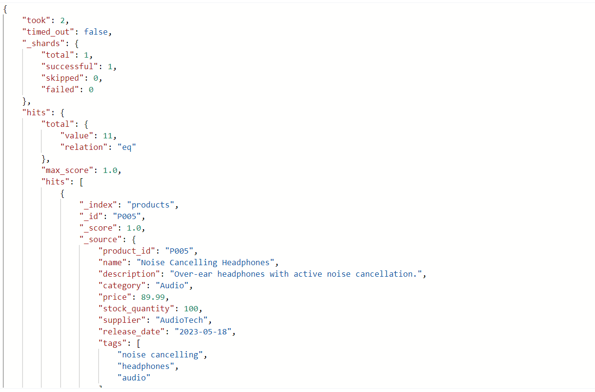
```
    3. 查询库存数量少于100的产品。
GET /products/_search
{
  "query": {
    "range": {
      "stock_quantity": {
        "lt": 100
      }
    }
  }
}
```
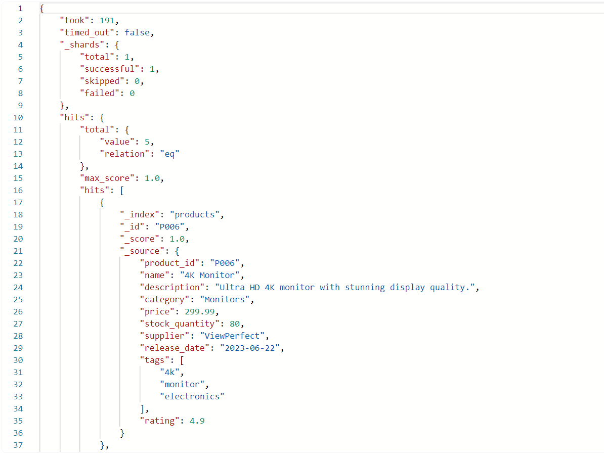
```
    4. 查找评分高于4.5的所有产品。
GET /products/_search
{
  "query": {
    "range": {
      "rating": {
        "gt": 4.5
      }
    }
  }
}

    5. 查询标签中包含"smart"的所有产品。
GET /products/_search
{
  "query": {
    "term": {
      "tags": "smart"
    }
  }
}

    6. 查找供应商为"TechCorp"的产品。
GET /products/_search
{
  "query": {
    "term": {
      "supplier": "TechCorp"
    }
  }
}

    7. 查询发布日期在2023年6月1日之后的所有产品。
GET /products/_search
{
  "query": {
    "range": {
      "release_date": {
        "gt": "2023-06-01"
      }
    }
  }
}

    8. 查找描述中包含"wireless"的产品。
GET /products/_search
{
  "query": {
    "match": {
      "description": "wireless"
    }
  }
}

    9. 查询价格在20美元到100美元之间的所有产品。
GET /products/_search
{
  "query": {
    "range": {
      "price": {
        "gte": 20,
        "lte": 100
      }
    }
  }
}

    10. 查找产品名称中包含"Light"的所有产品。
GET /products/_search
{
  "query": {
    "wildcard": {
      "name": "*Light*"
    }
  }
}

    
    
```
###   3.3. 订单记录数据
```
    1. 查询所有状态为"completed"的订单的订单ID和总金额。
GET /orders/_search
{
  "query": {
    "term": {
      "status": "completed"
    }
  },
  "_source": ["order_id", "total_amount"]
}
```
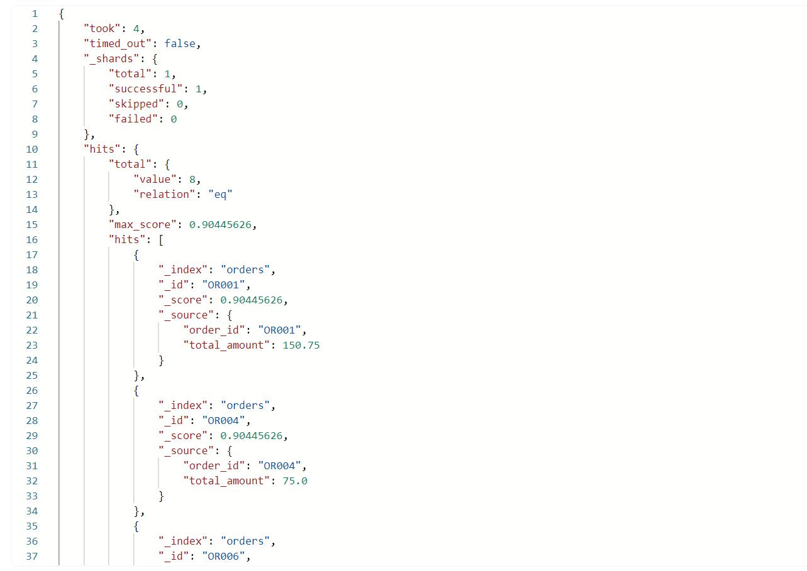

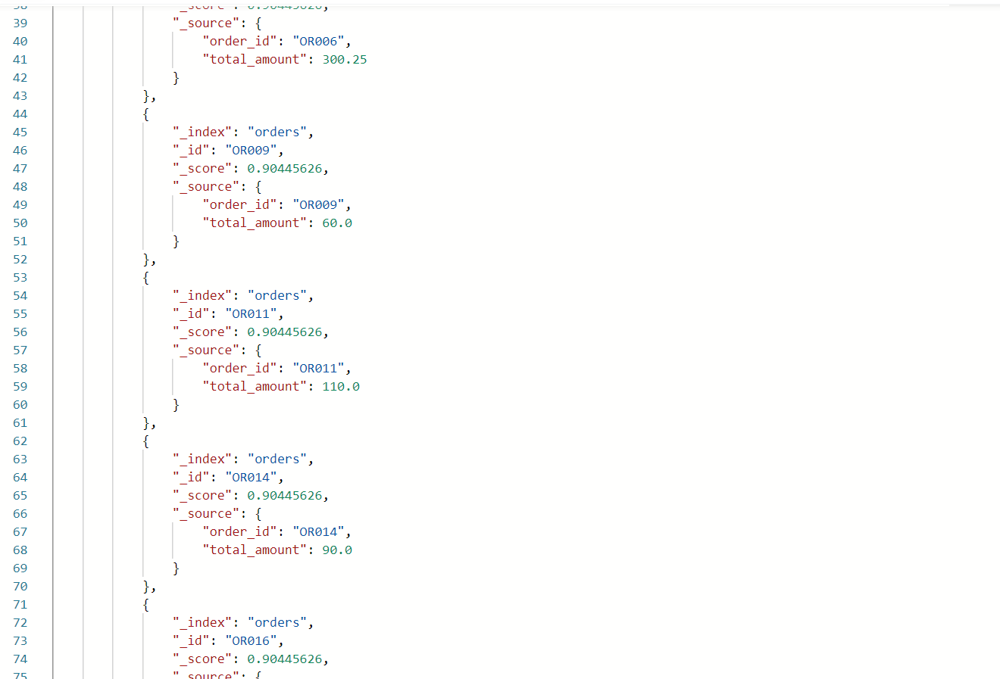

```
    2. 查找总金额大于100美元的所有订单。
GET /orders/_search
{
  "query": {
    "range": {
      "total_amount": {
        "gt": 100
      }
    }
  }
}
```
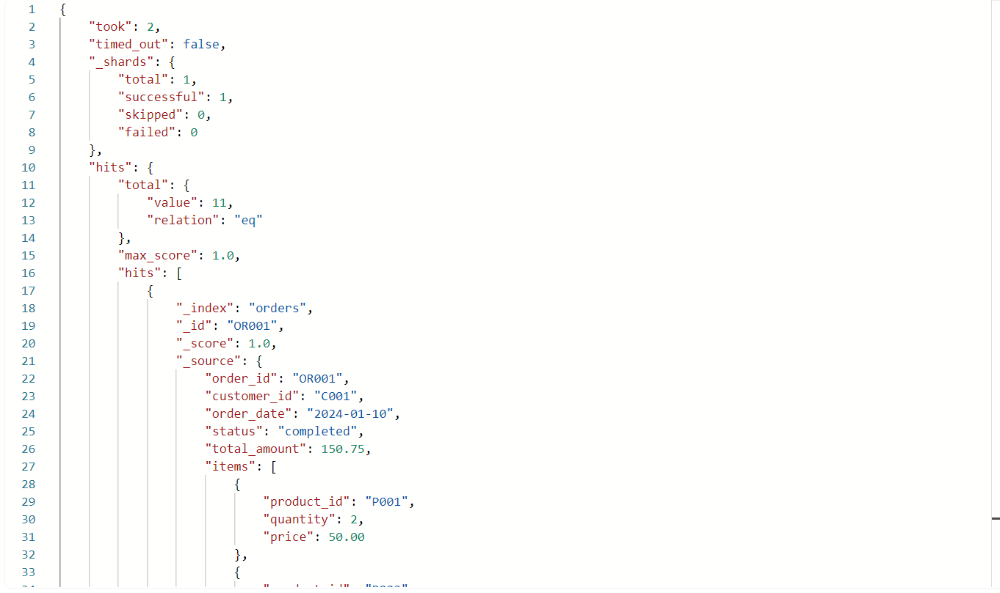

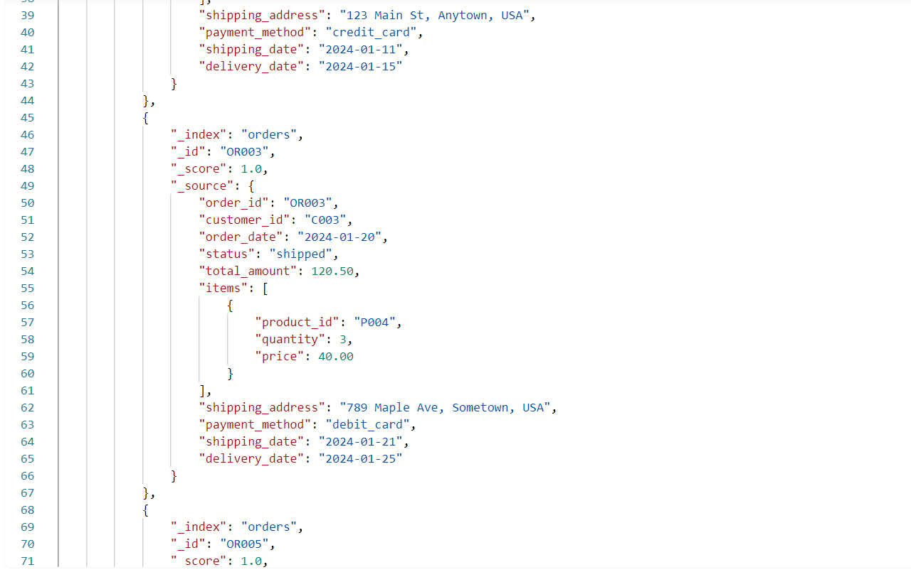

```
    3. 查询支付方式为"paypal"的订单。
GET /orders/_search
{
  "query": {
    "term": {
      "payment_method": "paypal"
    }
  }
}
```
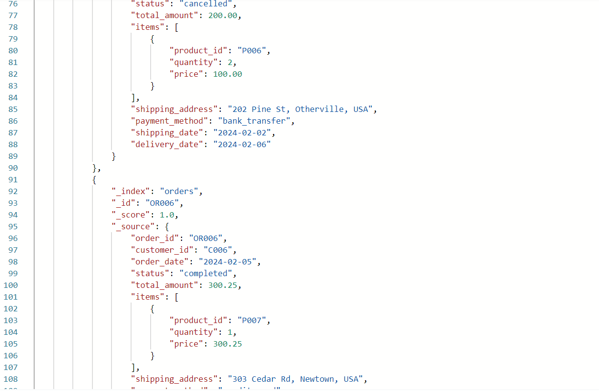
```
    4. 查找订单日期在2024年2月之后的所有订单。
GET /orders/_search
{
  "query": {
    "range": {
      "order_date": {
        "gt": "2024-02-01"
      }
    }
  }
}

    5. 查询包含产品ID为"P001"的订单。
GET /orders/_search
{
  "query": {
    "nested": {
      "path": "items",
      "query": {
        "term": {
          "items.product_id": "P001"
        }
      }
    }
  }
}

    6. 查找所有状态为"cancelled"的订单的客户ID。
GET /orders/_search
{
  "query": {
    "term": {
      "status": "cancelled"
    }
  },
  "_source": ["customer_id"]
}

    7. 查询发货日期在2024年1月15日之前的订单。
GET /orders/_search
{
  "query": {
    "range": {
      "shipping_date": {
        "lt": "2024-01-15"
      }
    }
  }
}

    8. 查找使用"credit_card"支付的订单。
GET /orders/_search
{
  "query": {
    "term": {
      "payment_method": "credit_card"
    }
  }
}

    9. 查询总金额在50美元到200美元之间的所有订单。
GET /orders/_search
{
  "query": {
    "range": {
      "total_amount": {
        "gte": 50,
        "lte": 200
      }
    }
  }
}


    10. 查找订单ID中包含"OR01"的所有订单。
GET /orders/_search
{
  "query": {
    "wildcard": {
      "order_id": "*OR01*"
    }
  }
}

    
```

 ## 三. 问题及解决办法

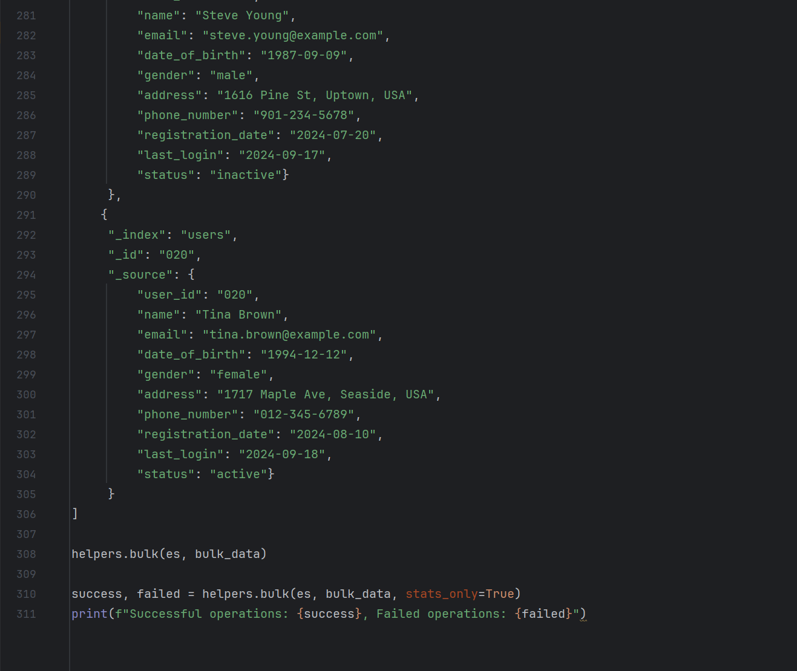

插入时尝试使用Python连接es数据库
